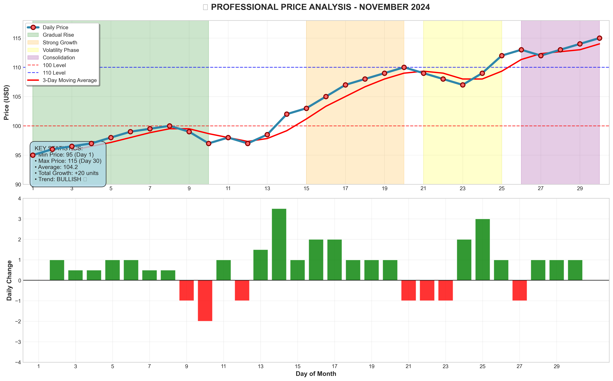

# AI-Real-World-Projects 🚀

A collection of **real-world AI & Machine Learning projects** to showcase Python, ML, and Deep Learning skills.  
Each project includes notebooks, sample data, and practical results.

---

## 📚 Projects Overview

1. **Crypto Price Prediction**  
   - Predict Bitcoin and cryptocurrency prices using Python and ML models  
   - Skills: Pandas, Matplotlib, Scikit-Learn, LSTM (optional)  

2. **Sentiment Analysis of Tweets**  
   - Analyze Twitter data for sentiment (positive/negative)  
   - Skills: NLP, Pandas, Matplotlib, Scikit-Learn, BERT (optional)  

3. **Product Recommendation System**  
   - Build recommendation engines for movies or products  
   - Skills: Collaborative Filtering, Pandas, NumPy  

4. **Image Object Detection**  
   - Detect objects in images using AI models  
   - Skills: OpenCV, TensorFlow/PyTorch, YOLO/Faster-RCNN  

---
## Sample Output



## ⚡ How to Use

1. Clone the repository:  
```bash
git clone https://github.com/saharsistani137777-lab/AI-Real-World-Projects.git
fix clone link
